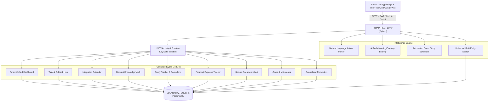

# ⚡ LifeOS — AI-Powered Personal Management Platform

> **LifeOS** is an integrated personal operating system that brings daily tasks, calendar schedules, personal knowledge notes, study sprints, expense tracking, a secure document vault, proactive reminders, long-term goals, and an AI assistant into a single unified platform.

Instead of fragmenting your life across separate note apps, calendar apps, todo apps, and expense spreadsheets, LifeOS connects everything into one cohesive dashboard that answers:
***"What do I need to know, remember, and do today?"***

---

## 🌟 Key Capabilities & Connected Architecture

LifeOS is built on the principle of **Connected Systems**:
* **Goal ➔ Milestone ➔ Task**: Breaking long-term goals into milestones automatically cascades into actionable tasks.
* **Task Deadlines ➔ Integrated Calendar**: Tasks with due dates automatically appear on your daily/weekly/monthly calendar.
* **Study System ➔ AI Exam Scheduler**: Subject topic masteries dynamically feed into an automated revision planner.
* **Document Vault ➔ Proactive Reminders**: Document expiries (Passports, Certifications, IDs) trigger countdown warnings 30/60/90 days in advance.
* **Natural Language Engine**: Type *"Spent ₹350 on lunch"*, *"Remind me to renew passport on Sept 12"*, or *"Submit assignment due Friday"* to instantly parse entities and execute verified database transactions.

---

## 🏗️ Architecture Overview



---

## 📦 9 Integrated Modules

| Module | Description |
| :--- | :--- |
| **1. Smart Dashboard** | Dynamic greeting, metrics ribbon, AI daily briefing with contextual insights, 🔴 urgent priority tasks, and next 7-day schedule. |
| **2. Tasks & Kanban** | Tasks, subtask trees, priority flags (Low/Medium/High/Urgent), due dates, completion percentages, and Kanban + List view modes. |
| **3. Integrated Calendar** | Month, week, and day views aggregating calendar events (Exams, Meetings, Appointments, Birthdays) with task deadlines. |
| **4. Notes & Knowledge Vault** | 3-pane knowledge base with custom folders, tag filtering, markdown editor, and rendered previews. |
| **5. Study Hub & Pomodoro** | Subject/Topic mastery progress sliders, interactive 25m Pomodoro study timer with countdown and sound chimes, and AI exam study planner. |
| **6. Personal Expenses** | Income & expense tracking, category breakdown (Food, Transport, Rent, Utilities, Education), monthly budget progress gauge, and cash flow stats. |
| **7. Document Vault** | Encrypted metadata registry for Passports, IDs, and Certificates with automated expiry countdown status badges (`EXPIRED`, `EXPIRING_SOON`, `VALID`). |
| **8. Goals & Milestones** | Long-term ambition roadmaps with auto-calculated milestone progress bars and a 1-click **"Create Task"** generator. |
| **9. Centralized Reminders** | Overdue flags, snooze (+1d), and multi-source reminder aggregation. |
| **AI Copilot & Command Palette (`Ctrl+K` / `Ctrl+J`)** | Floating universal command palette for cross-app multi-entity search and natural language actions. |

---

## 🚀 Quickstart Guide

### Prerequisites
* Python 3.10+
* Node.js 18+ and npm

### 1. Start Backend (FastAPI)
```bash
cd backend
pip install -r requirements.txt
uvicorn app.main:app --reload --port 8000
```
* Backend will be live at `http://localhost:8000`
* Interactive Swagger API docs: `http://localhost:8000/docs`
* *Auto-seeds demo user (`alex@lifeos.dev` / `demo123`) with rich interconnected data on first boot.*

### 2. Start Frontend (React + Vite)
```bash
cd frontend
npm install
npm run dev
```
* Open `http://localhost:5173` in your browser.
* Click **"One-Click Instant Demo"** to explore immediately!

---

## 🐳 Docker Deployment

To run the complete production stack (Frontend, Backend, and PostgreSQL database) with Docker Compose:

```bash
docker-compose up --build
```
* Web App: `http://localhost`
* API: `http://localhost:8000`
* PostgreSQL: `localhost:5432`

---

## 🧪 Automated Testing

LifeOS includes an end-to-end Pytest backend suite verifying authentication, relational integrity, task cascades, natural language parsing, and universal search:

```bash
cd backend
pytest tests/ -v
```

---

## 💼 Resume & Technical Highlights

When presenting LifeOS on your resume or portfolio:

> **LifeOS — AI-Powered Personal Management Platform**  
> *Developed a full-stack personal productivity platform integrating task management, calendar, notes, expenses, goals, study tracking, and intelligent reminders into a unified dashboard.*
> - **Backend Engineering**: Architected modular RESTful APIs using Python/FastAPI and SQLAlchemy with dual SQLite/PostgreSQL support, JWT token authentication, and strict foreign-key tenant data isolation.
> - **AI & Natural Language Processing**: Engineered a rule-based and LLM-compatible intent detection engine that translates natural language commands (e.g. *"Spent ₹350 on lunch"*, *"Remind me to study Java"*) into validated database transactions.
> - **Frontend Architecture**: Built a responsive, accessible React 18 + TypeScript + Tailwind CSS application featuring Kanban boards, Markdown previewing, Pomodoro study timers, dynamic SVG metric visualizations, and a global `Ctrl+K` command palette.
> - **DevOps & CI/CD**: Containerized the application using multi-stage Dockerfiles and Docker Compose; configured automated testing workflows with GitHub Actions.
